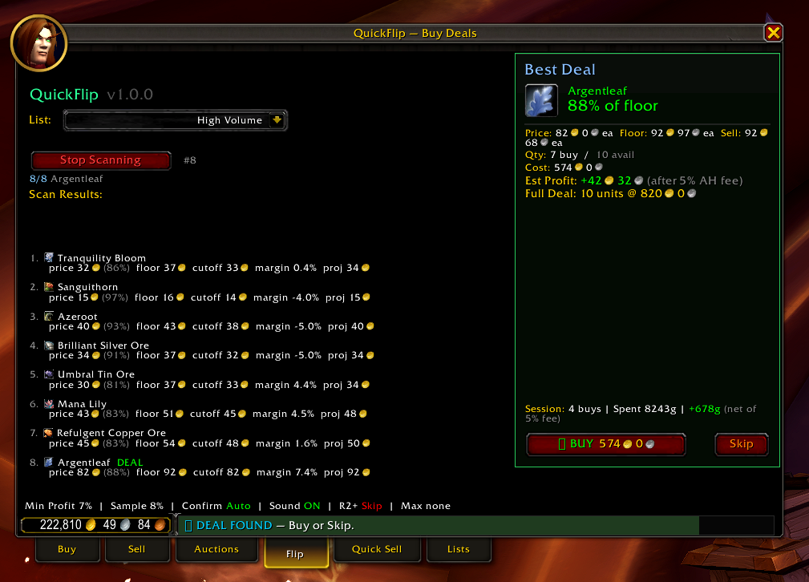

<div align="center">

# ⚡ QuickFlip

### Commodity Deal Scanner, One-Click Buyer & Smart Seller for World of Warcraft

**Automatically detect undervalued commodity listings on the Auction House, buy them with one click, and flip them for profit.**

[](https://worldofwarcraft.blizzard.com)
[](https://www.lua.org)
[](#-license)



</div>

---

> **⚠️ Notice:** `Scanner.lua` and `Buyer.lua` have been intentionally removed from this repository. This project is shared to showcase the idea and capabilities of commodity flipping automation — it is **not** a copy-paste ready solution. If you want a working addon, you must implement the scan engine and purchase logic yourself. See [Implement Yourself](#-implement-yourself) for a description of what each file does and guidance on building your own.

---

## 🔍 What Is QuickFlip?

QuickFlip is a **standalone** World of Warcraft addon for commodity flipping on the Auction House. It continuously scans your custom shopping lists, detects items listed significantly below the market floor price, and presents a **one-click buy** button with sound alerts. It also includes a **Quick Sell** module for automatically posting commodities at optimal undercut prices using wall detection.

> **No dependencies required** — QuickFlip includes its own shopping list manager, custom AH tabs, and all required libraries.

---

## ✨ Features

| Feature | Description |
|---------|-------------|
| 🔄 **Auto-Scanning** | Continuously cycles through your shopping list, checking each item multiple times per pass |
| 📋 **Built-in List Manager** | Create, edit, rename, import/export shopping lists — no external addon needed |
| 📊 **Smart Floor Pricing** | Calculates a weighted-average floor from the cheapest N% of listings — not just the lowest price |
| 🎯 **Deal Detection** | Flags items priced below a configurable profit margin after AH fees |
| 🔊 **Sound Alerts** | Custom audio cues when a deal is found and when a purchase succeeds |
| 🛒 **One-Click Buy** | Press K (or click the Buy button) to initiate a purchase — auto-confirms at the quoted price |
| 💰 **Session Tracking** | Tracks total spent, estimated revenue, and profit for the current session |
| 📤 **Quick Sell** | Automatically scan, price, post, and cancel commodity auctions with wall detection |
| ⚙️ **Settings Panel** | Full Interface > Addons settings page with sliders, checkboxes, and excluded-seller management |

---

## 📦 Installation

1. Download or clone this repository
2. Copy the contents into a folder named **`QuickFlip`** in your WoW addons directory:
   ```
   World of Warcraft/_retail_/Interface/AddOns/QuickFlip/
   ```
3. Your folder structure should look like:
   ```
   Interface/AddOns/QuickFlip/
   ├── QuickFlip.toc
   ├── Libs/
   │   ├── LibStub/
   │   └── LibAHTab/
   ├── Config.lua
   ├── Utils.lua
   ├── ListManager.lua
   ├── Seller.lua
   ├── UI.lua
   ├── Core.lua
   ├── notice.mp3
   └── order-filled.mp3
   ```
4. Restart WoW or type `/reload` in-game
5. Open the Auction House — look for the **"Flip"**, **"Quick Sell"**, and **"Lists"** tabs

---

## 🚀 Quick Start

1. **Open the Auction House** and click the **Lists** tab
2. **Create a shopping list** with the commodities you want to track (e.g. "Rousing Fire", "Awakened Fire")
3. Switch to the **Flip** tab and **select your list** from the dropdown
4. **Click "Start Scanning"** — the addon scans each item in your list
5. **When a deal appears** (green highlight + sound alert), press **K** or click **▶ BUY**
6. The addon auto-confirms the purchase and rescans for more deals

### Quick Sell — Getting Started

1. Stock up on commodities you want to flip
2. Switch to the **Quick Sell** tab and select your list
3. Click **Start Selling** — the addon scans each item, checks your bags, and queues posts/cancels
4. Click **▶ POST** or **✗ CANCEL** for each queued action

---

## ⌨️ Slash Commands

All commands use `/qf` or the longer `/quickflip` alias.

| Command | Description |
|:--------|:------------|
| `/qf help` | Show all available commands |
| `/qf uselist <name>` | Select a shopping list to scan |
| `/qf lists` | Show all available shopping lists |
| `/qf newlist <name>` | Create a new shopping list |
| `/qf dellist <name>` | Delete a shopping list |
| `/qf add <item>` | Add an item to the active list |
| `/qf remove <item>` | Remove an item from the active list |
| `/qf scan` | Start scanning |
| `/qf stop` | Stop scanning |
| `/qf enable` / `disable` | Master on/off toggle |
| `/qf profit <1-50>` | Set minimum profit % after AH fee |
| `/qf sample <1-50>` | Set floor sample size (bottom N% of listings) |
| `/qf maxprice <copper>` | Set max buy price cap (0 = no limit) |
| `/qf autoconfirm` | Toggle auto-confirm on price quotes |
| `/qf sound` | Toggle sound alerts |
| `/qf quality` | Toggle skipping rank 2+ crafting reagents |
| `/qf exclude <name>` | Toggle a seller in the exclusion list |
| `/qf verbose` | Toggle mirroring status messages to chat |
| `/qf config` | Open the settings panel |

---

## ⚙️ How It Works

### Two-Phase Scan

```
Phase 1 — Browse Query                    Phase 2 — Commodity Query
┌─────────────────────────┐               ┌─────────────────────────────┐
│ Send item name search   │──── match ──→ │ Fetch full commodity listings│
│ to get the ItemKey      │               │ sorted by price (cheapest   │
└─────────────────────────┘               │ first)                      │
                                          └──────────────┬──────────────┘
                                                         │
                                          ┌──────────────▼──────────────┐
                                          │ Calculate floor price from  │
                                          │ bottom N% of listings       │
                                          │                             │
                                          │ Deal = profit margin check  │
                                          └─────────────────────────────┘
```

### Floor Price Calculation

The addon doesn't just look at the cheapest listing. It takes the **bottom N%** of total listed quantity (by default, bottom 10%) and computes a quantity-weighted average price. This "floor" represents the actual going rate, filtering out outlier undercutters.

### Quick Sell — Wall Detection

The Quick Sell module scans items you have in your bags, calculates optimal sell prices using wall detection, and queues posts and cancellations. It walks through price tiers from cheapest to floor, and when cumulative quantity exceeds the wall threshold, it undercuts the wall to ensure fast sales.

### WoW API Constraints

| Action | Hardware Event Required? | Notes |
|--------|:------------------------:|-------|
| Search / Scan | ❌ No | Fully automated |
| Start Purchase | ✅ Yes | Must be triggered by user click or keypress |
| Confirm Purchase | ❌ No | Auto-confirmed after price quote |
| Cancel Purchase | ❌ No | Can cancel programmatically |
| Post Commodity | ✅ Yes | Must be triggered by user click |
| Cancel Auction | ✅ Yes | Must be triggered by user click |

---

## 📁 Project Structure

```
QuickFlip/
├── QuickFlip.toc          # Addon manifest — declares load order and metadata
├── Libs/                   # Bundled libraries
│   ├── LibStub/            # Library version manager (Public Domain)
│   └── LibAHTab/           # AH tab creation library (MIT)
├── Config.lua              # SavedVariables defaults and DB initialization
├── Utils.lua               # Shared utilities: Print, FormatMoney, SetStatus
├── ListManager.lua         # Built-in shopping list management (CRUD + import/export)
├── Scanner.lua             # ⚠️ NOT INCLUDED — see Implement Yourself below
├── Buyer.lua               # ⚠️ NOT INCLUDED — see Implement Yourself below
├── Seller.lua              # Quick-sell logic: scan, price, post, and cancel
├── UI.lua                  # Panel construction, deal card, results list, options
├── Core.lua                # Event hub, slash commands, tab creation (orchestrator)
├── notice.mp3              # Sound: deal detected
├── order-filled.mp3        # Sound: purchase succeeded
├── LICENSE.md              # Restrictive source-available license
├── CONTRIBUTING.md         # Contribution guidelines
└── README.md               # This file
```

### Load Order

Files are loaded by WoW in the order listed in the `.toc` file:

```
LibStub → LibAHTab → Config → Utils → ListManager → Scanner → Buyer → Seller → UI → Core
```

All files share state through the addon namespace table (`local ADDON_NAME, ns = ...`), which is the standard WoW addon pattern for inter-file communication.

---

## 🧩 Implement Yourself

`Scanner.lua` and `Buyer.lua` are **not included** in this repository. These two files contain the core scan-and-buy logic that makes QuickFlip work — the parts that actually find and execute deals. This project is shared to demonstrate the architecture and UI of a commodity flipping addon, not to provide a turnkey bot. To get a working addon you must implement both files yourself.

The sections below describe each file's responsibilities, the functions/state the rest of the addon expects, and enough detail to guide your implementation.

---

### Scanner.lua — Commodity Scan Engine

#### Purpose

The scanner implements a two-phase loop over items in a shopping list:

1. **Phase 1 — Browse:** Resolve an item name to a WoW `ItemKey` via `C_AuctionHouse.SendBrowseQuery` / `GetBrowseResults`.
2. **Phase 2 — Commodity:** Fetch full commodity listings for that ItemKey via `C_AuctionHouse.SendSearchQuery` / `GetCommoditySearchResultInfo`.

After retrieving listings, the scanner calculates a **floor price** (weighted average of the cheapest N% of listings by quantity), determines whether a **deal** exists (cheapest listing ≤ a profit-based cutoff), and either pauses scanning to present the deal or advances to the next item.

#### Required Functions

The rest of the addon expects `Scanner.lua` to define the following on `ns`:

| Function | Description |
|----------|-------------|
| `ns.CalcFloorPrice(itemID)` | Returns `floorAvg`, `minPrice`, `totalQty` — the weighted-average floor, cheapest listing price, and total AH quantity |
| `ns.ProjectSellPrice(itemID, floorPrice, cutoffPrice)` | Returns projected sell price after simulating removal of deal-priced stock |
| `ns.StartScan()` | Validates preconditions and kicks off the scan loop |
| `ns.StopScan()` | Halts scanning and resets state |
| `ns.DoScan()` | Fetches the shopping list and begins a full pass |
| `ns.ProcessNextItem()` | Advances to the next item in the queue (loops back on completion) |
| `ns.BeginBrowseQuery()` | Phase 1 — sends the browse query for the current item |
| `ns.OnBrowseResults()` | Handles Phase 1 response, finds item match, transitions to Phase 2 |
| `ns.BeginCommodityQuery()` | Phase 2 — sends the commodity search query |
| `ns.OnCommodityResults(itemID)` | Handles Phase 2 response — floor calc, deal detection, profitability gate |
| `ns.RescanCurrentItem()` | Re-queries the same item after a purchase to check for more deals |

#### Required State

The scanner should maintain these fields on `ns` (read by UI and Buyer):

| Field | Type | Description |
|-------|------|-------------|
| `ns.isScanning` | boolean | Whether a scan is currently active |
| `ns.state` | number | Current state (`ns.STATE_IDLE`, `ns.STATE_BROWSE`, `ns.STATE_COMMODITY`) |
| `ns.scanQueue` | table | Array of search-term strings from the shopping list |
| `ns.scanQueueIdx` | number | Current index into `scanQueue` |
| `ns.scanResults` | table | Array of result rows for the UI results list |
| `ns.scanCount` | number | Number of completed scan passes |
| `ns.currentItemKey` | table\|nil | The WoW ItemKey currently being scanned |
| `ns.rescanIter` | number | Current rescan iteration for the active item |

#### Scan Result Schema

Each entry in `ns.scanResults` should be a table with these fields so the UI can render it:

```lua
{
    term          = "search term",
    name          = "Item Name",
    itemID        = 12345,
    minPrice      = 15000,      -- cheapest listing (copper)
    floorPrice    = 18000,      -- weighted-average floor (copper)
    cutoffPrice   = 16200,      -- max buy price for a deal (copper)
    totalQty      = 500,        -- total AH quantity
    isDeal        = false,      -- passed all checks including profitability gate
    skipReason    = nil,        -- string if basic check passed but margin failed
    projSellPrice = 17500,      -- projected sell price (copper)
    margin        = 8.5,        -- projected profit margin (%)
    avgBuyPrice   = 15200,      -- avg cost of deal units (copper)
    error         = false,      -- true if item couldn't be resolved
}
```

#### Key Events to Handle

- `AUCTION_HOUSE_BROWSE_RESULTS_UPDATED` → call `ns.OnBrowseResults()`
- `COMMODITY_SEARCH_RESULTS_UPDATED` → call `ns.OnCommodityResults(itemID)`
- `AUCTION_HOUSE_THROTTLED_SYSTEM_READY` → resume scanning if throttled
- `AUCTION_HOUSE_SHOW_ERROR` (code 10) → throttle detected, pause scanning

#### Deal Detection Logic

The deal cutoff formula accounts for the 5% AH fee:

```
cutoff = floor × (1 − 0.05) / (1 + minProfitPct / 100)
```

An item is a deal when `minPrice ≤ cutoff` **and** the projected sell margin (after simulating purchase of deal stock) still meets the minimum profit threshold. This two-stage gate prevents false positives where buying the cheap stock would push your sell price too low to profit.

---

### Buyer.lua — Purchase Logic & Session Tracking

#### Purpose

The buyer manages the entire purchase flow once the Scanner detects a deal:

1. User presses **K** or clicks the **Buy** button (hardware event required by WoW).
2. `C_AuctionHouse.StartCommoditiesPurchase` sends a price quote request to the server.
3. `COMMODITY_PRICE_UPDATED` returns the true per-unit cost.
4. If the quoted price still qualifies as a deal → auto-confirm via `ConfirmCommoditiesPurchase` (no hardware event needed).
5. On success → log the purchase, update session totals, play a sound, and rescan.
6. On failure or stock gone → cancel the purchase and move on.

The buyer also tracks **session profit** (total spent, estimated revenue net of 5% AH fee, and buy count) and renders it in the deal card.

#### Required Functions

| Function | Description |
|----------|-------------|
| `ns.CancelPendingPurchase()` | Abort any in-flight purchase waiting for a price quote. Clears `ns.isWaitingForPrice` and `ns.pendingDeal`. |
| `ns.OnPurchaseEvent(self, event, ...)` | Central handler for all four purchase events (see below). Routes to confirm, cancel, log, or rescan as needed. |
| `ns.UpdateProfitDisplay()` | Refreshes the session-profit text in the deal card (`ns.profitText`). |
| `ns.InitBuyFrame()` | Creates a hidden frame and registers purchase events. Called once at addon init. |

#### Required State

| Field | Type | Description |
|-------|------|-------------|
| `ns.sessionBuys` | number | Total purchases this session |
| `ns.sessionSpent` | number | Total copper spent this session |
| `ns.sessionEstRevenue` | number | Estimated revenue (net of AH fee) this session |
| `ns.isWaitingForPrice` | boolean | Whether a price quote is in-flight |
| `ns.pendingDeal` | table\|nil | The deal currently being purchased (set by the Buy button handler in UI.lua) |
| `ns.buyFrame` | Frame | Hidden event frame for purchase events |

#### Pending Deal Schema

When the user clicks Buy, the UI sets `ns.pendingDeal` with these fields:

```lua
{
    itemID             = 12345,
    name               = "Item Name",
    quantity           = 50,
    unitPrice          = 15000,       -- cheapest listing price (copper)
    floorPrice         = 18000,       -- floor price (copper)
    projectedSellPrice = 17500,       -- projected post-purchase sell price (copper)
    confirmedPrice     = nil,         -- filled after COMMODITY_PRICE_UPDATED
}
```

#### Key Events to Handle

| Event | Action |
|-------|--------|
| `COMMODITY_PRICE_UPDATED` | Verify the quoted unit price still meets the profit threshold. If yes → `ConfirmCommoditiesPurchase`. If no → cancel and rescan. |
| `COMMODITY_PRICE_UNAVAILABLE` | Stock is gone. Cancel purchase, clear deal card, continue scanning. |
| `COMMODITY_PURCHASE_SUCCEEDED` | Log the buy: print item link, quantity, cost, projected sell, and profit. Update session totals. Play `SOUND_PURCHASED`. Rescan. |
| `COMMODITY_PURCHASE_FAILED` | Clear state and rescan. |

#### Profit Verification Formula

When the price quote arrives, the buyer re-checks profitability:

```
netSell = projectedSellPrice × (1 − 0.05)     -- after AH fee
margin  = (netSell − quotedUnitPrice) / quotedUnitPrice × 100
```

Confirm only if `margin ≥ minProfitPct`.

---

## 🔧 Configuration

Open the settings panel with `/qf config` or via **Interface → Addons → QuickFlip**.

### Buy Settings

| Setting | Default | Description |
|---------|---------|-------------|
| Min Profit | 10% | Minimum profit margin after 5% AH fee to trigger a deal |
| Sample Size | 10% | Bottom % of listings used for floor calc |
| Rescan Count | 3 | Times to re-check each item per scan pass |
| Max Buy Price | 0 (none) | Absolute copper cap on purchases |
| Buy % of Deal | 50% | Percentage of deal quantity to buy |
| Max Buy Qty | 200 | Cap on units to buy per deal |

### Sell Settings

| Setting | Default | Description |
|---------|---------|-------------|
| Unit Cap | 200 | Max total units listed per item |
| Per Stack | 50 | Max units per auction listing |
| Max Listings | 5 | Max separate listings per item |
| Undercut | 1s | Silver to undercut by |
| Wall Threshold | 10% | % of volume that constitutes a wall |
| Max Undercut | 10% | Max % below floor to price at |
| Duration | 24h | Auction duration (12h/24h/48h) |

### General

| Setting | Default | Description |
|---------|---------|-------------|
| Enabled | ✅ On | Master on/off toggle |
| Auto-Confirm | ✅ On | Automatically confirm purchases |
| Skip Rank 2+ | ✅ On | Ignore higher-tier crafting reagents |
| Verbose | ❌ Off | Mirror status bar to chat |
| Sound on Deal | ✅ On | Play audio alerts |
| Sound on Sold | ✅ On | Play sound when auction sells |
| Sound on Expired | ✅ On | Play sound when auction expires |

---

## 📄 License

This project is released under a **Restrictive Source-Available License**.
You may view and study the code for personal educational purposes, and run it
as a WoW addon for personal use. **Redistribution, resale, code reuse in other
projects, and AI/ML training are strictly prohibited.**

See [LICENSE.md](LICENSE.md) for the full terms.

Bundled libraries are used under their respective licenses:
- **LibStub** — Public Domain
- **LibAHTab** — MIT License

---

<div align="center">

*Built for World of Warcraft: The War Within / Midnight*

</div>
